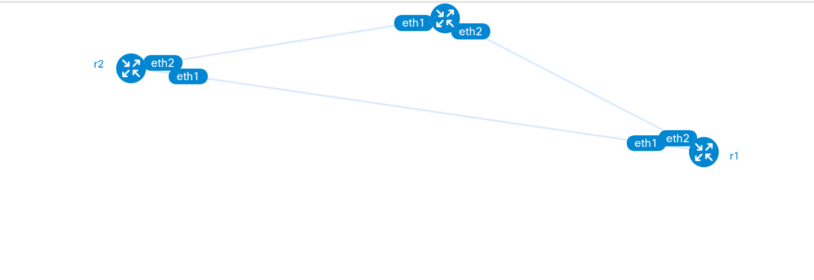

# Network AI Automation using MCP Server

Automate network configuration and management using Containerlab, Claude AI through Model Context Protocol (MCP) Server, integrated with Ansible and Arista routers.

## 🚀 Overview

This project leverages Containerlab Claude AI and the Model Context Protocol (MCP) to provide intelligent network automation capabilities. It combines the power of AI-driven decision making with industry-standard Ansible playbooks to manage Arista network devices efficiently.

### Key Features

- **AI-Powered Automation**: Use Claude AI to intelligently manage network configurations
- **MCP Server Integration**: Seamless integration with Claude through MCP for dynamic network operations
- **Ansible Integration**: Industry-standard playbooks for reliable network automation
- **Arista Router Support**: Direct support for Arista EOS devices
- **OSPF Configuration**: Automated OSPF routing protocol management
- **Scalable Design**: Organize your network infrastructure with intent-based configurations

## 📋 Prerequisites

Before you begin, ensure you have the following installed:

- [x] Containerlab and Docker
- [x] Python 3.8 or higher
- [x] Ansible 2.9+
- [x] Access to Claude API with MCP Server capability
- [x] Arista router images that will be deployed in containerlab
- [x] SSH access configured for your network devices

What you'll find below:
- [x] How to **setup this lab** from scratch
- [x] The current **topology diagram** PNG
- [x] The **Containerlab YAML** lab file
- [x] The **NETWORK.json** inventory file
- [x] The **Intent.Json** inventory file
- [x] The Ansible playbook file 
- [x] Important notes and guidance

## ⚒️ Project Tech Stack
The main tools and technologies used for building the project:
- [x] Claude AI (Claude Code)
- [x] MCP Server (FastMCP)
- [x] ContainerLab
- [x] Ansible
- [x] Python
- [x] Scrapli
- [x] EOS eAPI (Arista)
- [x] Ubuntu
- [x] VS Code
- [x] VirtualBox/VMware

## 🛠️ Environment Setup
Below you'll find guidance for building the lab before you move to the network topology section. if you have more space you can add

**My VM resources for this lab**:
- [x] VirtualBox or VMware
- [x] Ubuntu 24.04.4 VM
- [x] 4 processor cores
- [x] 4 GB RAM memory
- [x] 50 GB hard disk

**Summary Checklist** 
## 🔧 Steps to build topology and configure the routers and 

- [x] Initial installation and upgrades of all requirements include fastmcp.

```bash
- git clone https://github.com/chiwiks/Network-AI-Automation-using-MCP-Server.git
- cd Network-AI-Automation-using-MCP-Server
- python3 -m venv mcp
- source mcp/bin/activate
- pip install --upgrade pip
- pip install fastmcp==3.0.0b1 scrapli asyncssh python-dotenv
```


- [x] Install Docker and Containerlab

- [x] Download and import official Arista router images into Docker:
```
- [Aristat cEOs] (https://www.arista.com/en/login) image
- Download lates cE0 image with .tar.xz
- sudo docker import ~/cEOS64-lab-4.35.0F.tar.xz ceos:4.35.0F
- docker images

```
- [x] Build your topology using Containerlab and *** aris.yml *** file
```
name: aris-lab


topology:
  nodes:
    r1:
      kind: arista_ceos
      image: ceos:4.35.0F
      mgmt-ipv4: 172.20.20.11
    r2:
      kind: arista_ceos
      image: ceos:4.35.0F
      mgmt-ipv4: 172.20.20.22
    r3:
      kind: arista_ceos
      image: ceos:4.35.0F
      mgmt-ipv4: 172.20.20.33

  links:
    - endpoints: ["r1:eth1", "r2:eth1"]
    - endpoints: ["r2:eth2", "r3:eth1"]
    - endpoints: ["r1:eth2", "r3:eth2"]

# The topology consists of three Arista router connected to each other

```
- [x] Run the Containerlab commands to build topolgy
```
- containerlab deploy -t aris.yml (build topology)
- containerlab save -t aris.yml ( save topology and configurations)
- containerlab inspect -t aris.yml (check the condition of the topology)
- containerlab redeploy -t aris.yml (redeploy the deploy the topolgy)
- docker exec -it <container-name/id> Cli  (connect to different routers after they are deployed default is enable)

- containerlab graph -t aris.yml (view topology. The png is found topology folder)
- containerlab destroy -t aris.yml (Destroy the topology)
- Name of the three routers are clab-mcp-lab-r1 clab-mcp-lab-r2 clab-mcp-lab-r1
```
- [x] Current Topology:
      

  
  

- [x] Use Ansible playbook file to configure interface ip and OSPF on the three Arista routers.
```
- When you build your topology using containerlab, it automatically creates an ansible inventory file of the topolgy. Run the playbook_ospf.yml to configure the arista routers.

- name: configure ospf on the three routers
   hosts: arista_ceos
   gather_facts: no

   tasks: 
     - name: Configure R1 interfaces
       arista.eos.eos_interfaces:
        config:
          - name: Ethernet1
            enabled: true
            mode: layer3
          - name: Ethernet2
            enabled: true
            mode: layer3
        state: merged
       when: inventory_hostname == "clab-aris-lab-r1"

     - name: Configure R2 interfaces
       arista.eos.eos_interfaces:
        config:
          - name: Ethernet1
            enabled: true
            mode: layer3
          - name: Ethernet2
            enabled: true
            mode: layer3
        state: merged
       when: inventory_hostname == "clab-aris-lab-r2"

     - name: Configure R3 interfaces
       arista.eos.eos_interfaces:
        config:
          - name: Ethernet1
            enabled: true
            mode: layer3
          - name: Ethernet2
            enabled: true
            mode: layer3
        state: merged
       when: inventory_hostname == "clab-aris-lab-r3"


     - name: Configure R1 layer interfaces
       arista.eos.eos_l3_interfaces:
         config:
        
           - name: Ethernet1
             ipv4:
               - address: 192.168.12.1/24
           - name: Ethernet2
             ipv4:
               - address: 192.168.13.1/24
         state: merged
       when: inventory_hostname == "clab-aris-lab-r1"
      
     - name: Configure R2 layer interfaces
       arista.eos.eos_l3_interfaces:
         config:
           - name: Ethernet1
             ipv4:
               - address: 192.168.12.2/24
           - name: Ethernet2
             ipv4:
               - address: 192.168.23.2/24
         state: merged
       when: inventory_hostname == "clab-aris-lab-r2" 

     - name: Configure R3 layer interfaces
       arista.eos.eos_l3_interfaces:
         config:   
           - name: Ethernet1
             ipv4:
               - address: 192.168.23.3/24
           - name: Ethernet2
             ipv4:
               - address: 192.168.13.3/24

         state: merged
       when: inventory_hostname == "clab-aris-lab-r3"
         


     - name: Configure OSPF on the three routers
       arista.eos.eos_ospfv2:
         config:
          hostname: clab-aris-lab-r1
           - process_id: 1
             router_id: "1.1.1.1"
             areas:
               id: "0.0.0.0"
               type: normal
             networks:
               - area: "0.0.0.0"
                 prefix: 192.168.12.0/24
               - area: "0.0.0.0"
                 prefix: 192.168.13.0/24
         state: merged
         
          hostname: clab-aris-lab-r2
           - process_id: 1
             router_id: "2.2.2.2"
             areas:
               id: "0.0.0.0"
               type: normal
             networks:
               - area: "0.0.0.0"
                 prefix: 192.168.12.0/24
               - area: "0.0.0.0"
                 prefix: 192.168.23.0/24
          state: merged
          
          hostname: clab-aris-lab-r3
           - process_id: 1
             router_id: "3.3.3.3"
             areas:
               id: "0.0.0.0"
               type: normal
             networks:
               - area: "0.0.0.0"
                 prefix: 192.168.23.0/24
               - area: "0.0.0.0"
                 prefix: 192.168.13.0/24
          state: merged

```
- [x]  Create the newtwork json inventory file containing the three routers and their types and type of connection that will be used to log into them.
```
{
	"R1": { "host": "172.20.20.11", "platform": "arista_eos", "transport": "asyncssh"},
	"R2": { "host": "172.20.20.22", "platform": "arista_eos", "transport": "asyncssh"},
	"R3": { "host": "172.20.20.33", "platform": "arista_eos", "transport": "asyncssh"}
}
```

## 🔧 Build the python MCP Server that will be connected to your topology

- [x] Mcpserver.py code summary
 
- [x] Showcommand input model that handles input like show and display commands input from the client that the MCP runs on the devices (takes device and command names)
```
   class ShowCommand(BaseModel):
    """Run show command against network device"""
      device: str = Field(..., description="Device name from inventory (e.g. R1, R2 , R3)")
      command: str = Field(..., description="Show command to execute on the device")
```
- [x] Config Input model that handles the push configuration of the devices (takes device and command names)
```
   class ConfigCommand(BaseModel):
    """ Send configuration commands to one or more devices"""
      devices: list[str] = Field(..., description="Device names from inventory (e.g. ['R1', 'R2'])")
      commands : list[str] = Field(..., description="Configuration commands to apply")
```

 - [x]  Feed the functions that handle the show and config into mcp server
```
  - run_show function  takes params from the ShowCommand input base model
  @mcp.tool(name="run_show")
  async def run_show(params: ShowCommand)

  - push_config function takes the params from the ConfigCommand input base model
  @mcp.tool(name="push_config")
  async def push_config(params: ConfigCommand) -> dict

  Both functions are feed to the MCP ai server using the @mcp.tool
  ```
- [x] Next connect your mcpserver script to the Claude ai
```
Run the command "claude mcp add mcp_network_automation -s user -- ./mcp/bin/python MCPServer.py"
Note: mcp_network_automation is name of FastMCP that was imported in McpServer.py script

Run the command "claude mcp list" -> Connected showing that your mcp server is connected to Claude

```
## 🔧 Examples of using your claude AI connected to your MCP to run show commands
- [x] Ask Claude to check interface ip address of R2
```
 
```

